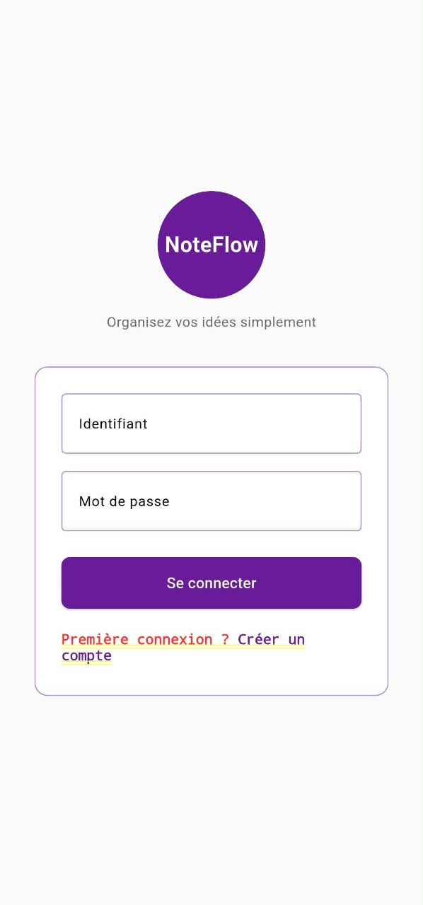
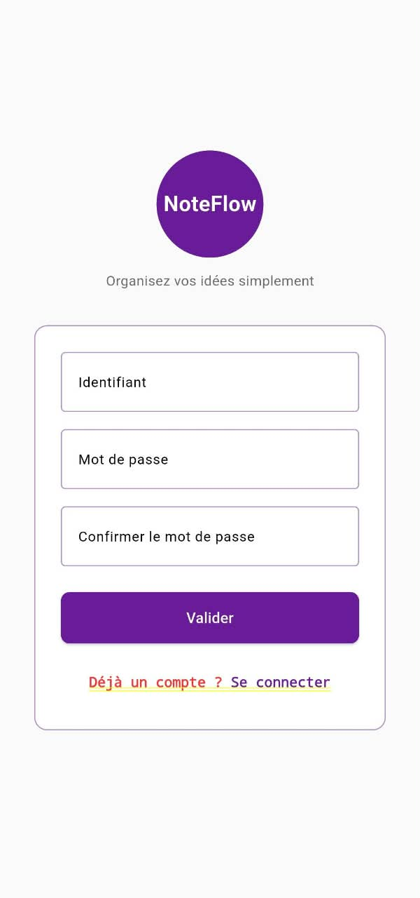
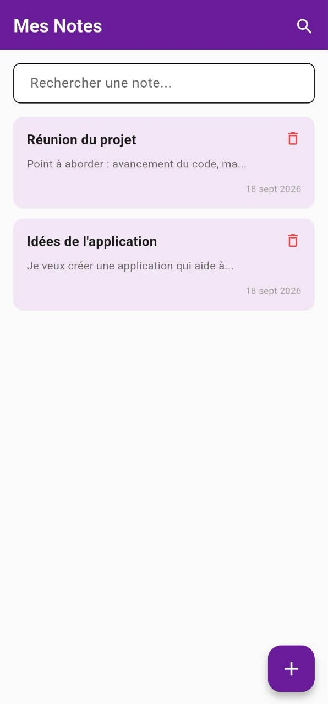
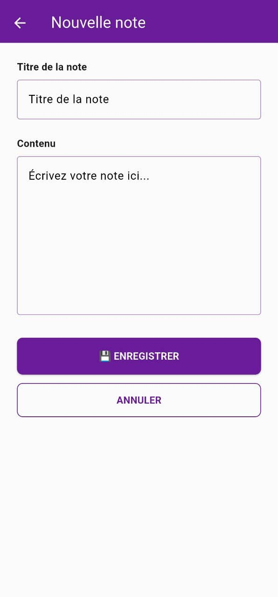
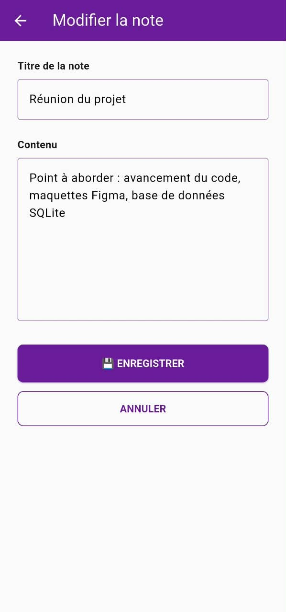
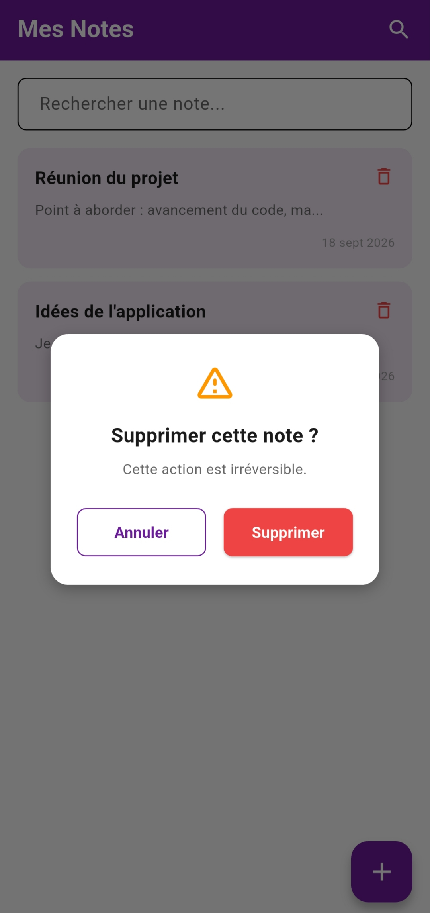

# 📝 NoteFlow — Organisez vos idées simplement

> Application mobile complète de gestion de notes, développée avec Flutter et SQLite.

---

## ✨ Fonctionnalités

- 🔐 **Connexion / Création de compte** — Interface élégante et validation des champs
- 📋 **Liste des notes** — Affichage dynamique avec aperçu et date de création
- 🔍 **Recherche en temps réel** — Filtre les notes par titre ou contenu
- ➕ **Ajout de note** — Formulaire dédié avec titre et contenu
- ✏️ **Modification** — Mise à jour des notes existantes
- 🗑️ **Suppression** — Confirmation avant suppression définitive
- 💾 **Persistance locale** — Base de données SQLite (sqflite)
- 🎨 **Design personnalisé** — Maquetté sur Figma avec charte graphique violette

---

## 📱 Captures d'écran

| Connexion | Création de compte |
|---|---|
|  |  |

| Liste des notes | Ajouter une note |
|---|---|
|  |  |

| Modifier une note | Suppression |
|---|---|
|  |  |


---

## 🛠️ Technologies utilisées

| Outil | Version / Usage |
|---|---|
| **Flutter** | 3.x — Framework UI |
| **Dart** | 3.x — Langage |
| **sqflite** | ^2.3.0 — Base de données SQLite locale |
| **path** | ^1.8.3 — Gestion des chemins |
| **Figma** | — — Conception et maquettage |

---

## 📂 Structure du projet

noteflow/
├── lib/
│ ├── main.dart # Point d'entrée
│ ├── constantes.dart # Couleurs et charte graphique
│ ├── modele/
│ │ └── note.dart # Modèle de données Note
│ ├── services/
│ │ └── db_service.dart # Gestion SQLite — CRUD complet
│ └── views/
│ ├── connexion.dart # Écran de connexion
│ ├── creer_compte.dart # Création de compte
│ ├── liste_notes.dart # Liste + recherche + FAB
│ ├── note_edition.dart # Ajout / Modification
│ └── confirmation_suppression.dart # Popup de confirmation
├── captures/ # Captures d'écran
│ ├── 01_connexion.jpeg
│ ├── 02_creation_compte.jpeg
│ ├── 03_liste_notes.jpeg
│ ├── 04_ajout_note.jpeg
│ ├── 05_modification.jpeg
│ └── 06_suppression.jpeg
├── pubspec.yaml # Dépendances
└── README.md

---

## 🚀 Comment exécuter le projet

### Prérequis
- Flutter SDK installé
- Un éditeur (VS Code / Android Studio)
- Un appareil ou émulateur connecté

### Étapes
```bash
# 1. Cloner le dépôt
git clone https://github.com/Yvon-30/noteflow.git
cd noteflow

# 2. Installer les dépendances
flutter pub get

# 3. Lancer l'application
flutter run

🎨 Conception

    Prototype Figma : https://www.figma.com/proto/IzMZh267TUqJlE0FtzRPTa/MENSAH_Yvon_Wireframe_NoteFlow?node-id=1-3&t=9iR1JJcwVG2BDHyt-1&scaling=scale-down&content-scaling=fixed&page-id=1%3A2&starting-point-node-id=1%3A3
    Palette de couleurs :
        Principale : #6A1B9A (violet foncé)
        Secondaire : #9C27B0 (violet moyen)
        Carte : #F3E5F5 (violet très clair)
        Fond : #FAFAFA (blanc cassé)
        Danger : #EF4444 (rouge)

📝 Auteur
Yvon MENSAH
Projet intégrateur — Semaine 6
Formation Développement Mobile Flutter